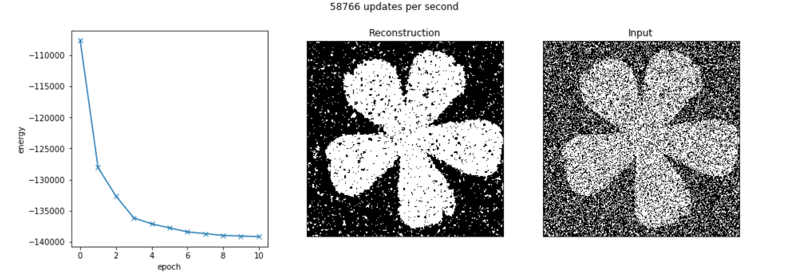
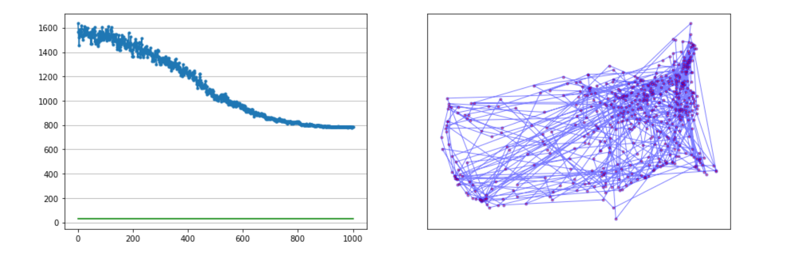

# MCMC, Ising Model & TSP

This repo contains implementations of various MCMC sampling procedures.
As well as an implementation of simmulated annealing in order to approximate
a local minima in the traveling salesman problem. A implementation of the ising
model to perform noise reduction is also provided.

### Plots

#### References

* [1] http://www.cs.princeton.edu/courses/archive/spr06/cos598C/papers/AndrieuFreitasDoucetJordan2003.pdf
* [2] Bishop, Christopher M. "Pattern Recognition and Machine Learning." (2006).
